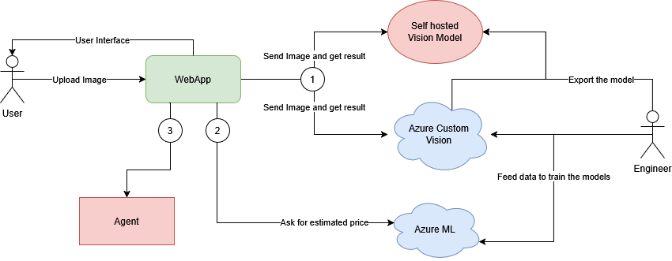

# AutoExpert AI - Inspection automatisee de vehicules

> Projet de la matiere **Microsoft Azure** - EPITA
> Un systeme qui inspecte un vehicule a partir de photos, evalue son etat, et
> orchestre les demarches d'evaluation et de negociation via des agents.

Le systeme demontre les **4 capacites** exigees par le sujet :

| Capacite | Technologie | Role |
|----------|-------------|------|
| **(1) Cognitive** | Azure Computer Vision (Image Analysis ou Custom Vision) | Detecte les dommages visibles (rayures, bosses, fissures, usure pneus...) |
| **(2) Edge** | FastAPI + Docker (execution locale) | Webapp qui tourne en local sur le laptop |
| **(3) Machine Learning** | Azure ML (endpoint temps reel, comme le tutoriel) | Estime le cout de reparation et la valeur marchande |
| **(4) Agentique** | Agent orchestrateur + 3 sous-agents (Ollama ou Gemini) | Coordonne evaluation, rapport, negociation |

> Le projet demarre sans aucun compte Azure ni cle. Par defaut tout
> fonctionne en mode **mock** (services simules, deterministes). Le code est
> neanmoins cable sur les vrais SDK Azure : il suffit de passer `AZURE_MODE=real`
> et de fournir les cles pour basculer en production.



---

## Demarrage rapide (mode mock, zero configuration)

### Option A - En local avec Python (recommande pour debuter)

```bash
python -m venv .venv
.\.venv\Scripts\activate        # Windows PowerShell
# source .venv/bin/activate     # macOS / Linux

pip install -r requirements.txt

# Lancer l'interface web
uvicorn app.main:app --reload
#  -> ouvrir http://localhost:8000

# OU lancer la demo en ligne de commande (sans navigateur)
python demo_cli.py
```

> Note : pour le mode mock, les SDK Azure ne sont pas strictement necessaires.
> Si l'installation des paquets azure-* pose souci, vous pouvez les commenter
> dans requirements.txt - l'application reste pleinement fonctionnelle.

### Option B - Avec Docker

```bash
docker compose up --build
#  -> ouvrir http://localhost:8000

# Avec un LLM Ollama local pour les syntheses des agents :
docker compose --profile llm up --build
```

---

## Utilisation

1. Ouvrir http://localhost:8000
2. Renseigner les infos du vehicule (un bouton "Charger un exemple" existe).
3. Optionnel : ajouter des photos / une video 360.
4. Cliquer "Lancer l'inspection".
5. Le rapport s'affiche : dommages, cout des reparations,
   valorisation, strategie de negociation, et le journal des agents.

---

## Faire la demo (soutenance)

### 1. Demarrer l'application

Depuis le dossier du projet, environnement virtuel active :

```bash
uvicorn app.main:app --host 127.0.0.1 --port 8000
```

Sous Windows PowerShell, sans activer le venv :

```powershell
.\.venv\Scripts\python.exe -m uvicorn app.main:app --host 127.0.0.1 --port 8000
```

Puis ouvrir http://127.0.0.1:8000 dans le navigateur.

Pour appuyer la capacite Edge, on peut aussi lancer via Docker :

```bash
docker compose up --build
```

### 2. Deroule de la demo (environ 3 minutes)

1. Montrer le badge de mode en haut a droite (CV / ML / LLM) : il prouve que
   l'app sait basculer entre mock et services Azure.
2. Cliquer sur **"Charger un exemple"** (charge un cas BMW Serie 3 realiste).
3. Cliquer sur **"Lancer l'inspection"**.
4. Commenter le rapport qui s'affiche :
   - **Dommages detectes** = capacite Computer Vision.
   - **Evaluation mecanique + cout** et **valorisation** = capacite Machine Learning.
   - **Negociation** = sous-agent de negociation.
   - **Journal des agents** (en bas) = montre l'orchestrateur qui delegue aux
     sous-agents, dans l'ordre : capacite Agentique.
5. Relancer avec un autre exemple pour montrer un profil different (ex. une photo
   d'epave fait chuter l'etat et bascule le vehicule en perte totale).

### Brancher la vision sur un conteneur local (Custom Vision exporte)

Le projet peut appeler un modele de vision qui tourne en local (par ex. un
modele Azure Custom Vision exporte en conteneur Docker/WSL, qui expose
`POST /image` et renvoie un tableau `predictions`).

Dans `.env` :

```
VISION_PROVIDER=local_http
AZURE_VISION_ENDPOINT=http://localhost:88
```

Comportement :
- Le module vision envoie chaque image uploadee au conteneur, sur `/image`.
- La reponse (classification, ex. tags `Good` / `Destroyed`) est traduite en
  dommage(s) avec une severite proportionnelle a la probabilite.
- Le badge en haut de la page affiche alors `CV:local_http`.

Important pour la demo : ce mode ne s'active reellement que si l'on **uploade
une vraie photo**. Le bouton "Charger un exemple" (sans photo) et les entrees
invalides retombent automatiquement sur le simulateur, pour ne jamais planter.

Pour demontrer le conteneur en soutenance : remplir le formulaire, **ajouter une
photo de vehicule** via le champ fichier, puis lancer l'inspection.

Le modele utilise est fourni dans `custom_vision_model/` (modele Azure Custom
Vision exporte, labels `Good` / `Destroyed`). Pour le construire et le lancer :

```bash
cd custom_vision_model
docker build -t autoexpert-vision .
docker run -p 127.0.0.1:88:80 -d autoexpert-vision
```

Il expose alors `POST http://localhost:88/image`. Details dans
`custom_vision_model/README.txt`.

### Brancher Azure Custom Vision en classification

Pour appeler directement un modele Custom Vision publie dans Azure avec une URL
du type `/classify/iterations/.../image`, utiliser le provider `custom_vision`
et declarer le modele en mode classification :

```env
AZURE_MODE=real
VISION_PROVIDER=custom_vision
CUSTOM_VISION_ENDPOINT=https://germanywestcentral.api.cognitive.microsoft.com
CUSTOM_VISION_KEY=<prediction-key>
CUSTOM_VISION_PROJECT_ID=<project-id>
CUSTOM_VISION_ITERATION=Iteration1
CUSTOM_VISION_MODE=classify
```

Le code construit alors :

```text
{CUSTOM_VISION_ENDPOINT}/customvision/v3.0/Prediction/{CUSTOM_VISION_PROJECT_ID}/classify/iterations/{CUSTOM_VISION_ITERATION}/image
```

Pour un modele Custom Vision de detection avec bounding boxes, garder
`CUSTOM_VISION_MODE=detect`.

### 3. Verifier que le serveur repond (optionnel)

```bash
curl http://127.0.0.1:8000/api/health
```

### 4. Arreter le serveur

Fermer le terminal, ou sous PowerShell :

```powershell
Get-Process python | Where-Object { $_.Path -like '*Projet_MAZU*' } | Stop-Process -Force
```

---

## Tests

```bash
pytest -q
```

Les tests valident le pipeline complet en mode mock (determinisme de la vision,
coherence des couts, orchestration de bout en bout).

---

## Structure du projet

```
Projet_MAZU/
├── README.md                     # Ce fichier
├── requirements.txt              # Dependances Python
├── Dockerfile                    # Image de la webapp (brique Edge)
├── docker-compose.yml            # Orchestration locale (web + ollama optionnel)
├── .env.example                  # Modele de configuration (copier en .env)
├── demo_cli.py                   # Demo sans navigateur
│
├── app/                          # Application principale
│   ├── main.py                   #   API web FastAPI (endpoints /api/inspect + stream)
│   ├── config.py                 #   Configuration (.env), bascule mock/real
│   ├── models/schemas.py         #   Contrats de donnees (Pydantic) partages
│   ├── computer_vision/          #   BRIQUE 1 - Vision (Azure / Custom Vision / local / mock)
│   ├── machine_learning/         #   BRIQUE 3 - Azure ML : cout + valeur (+ mock)
│   ├── llm/                      #   Acces LLM (Ollama / Gemini / Mistral / template)
│   ├── agents/                  #   BRIQUE 4 - orchestrateur + 3 sous-agents
│   │   ├── orchestrator.py       #     agent principal (coordination + streaming)
│   │   ├── evaluation_agent.py   #     sous-agent evaluation mecanique
│   │   ├── negotiation_agent.py  #     sous-agent negociation de prix
│   │   └── report_agent.py       #     sous-agent generation de rapport
│   └── static/                  #   Interface web (HTML/CSS/JS + orchestration live)
│
├── vision_service/               # Service vision de secours (stub Custom Vision)
├── custom_vision_model/          # Modele Azure Custom Vision exporte (conteneur port 88)
│
├── data/sample_vehicles.json     # Vehicules d'exemple
├── tests/test_pipeline.py        # Tests automatises
└── architecture-azure.png        # Diagramme d'architecture
```

---

## Passer en mode Azure reel

1. Copier .env.example en .env
2. Renseigner AZURE_MODE=real + les cles Azure Vision et/ou Azure ML.
3. (Optionnel) LLM_MODE=ollama ou LLM_MODE=gemini pour des syntheses par LLM.

Chaque brique bascule automatiquement du mode mock au service Azure reel des
que la cle correspondante est fournie, sans modifier le code.
